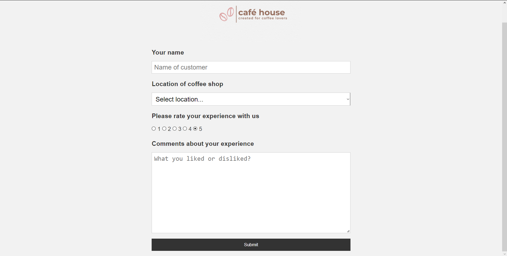
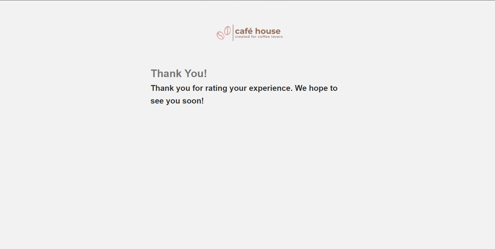
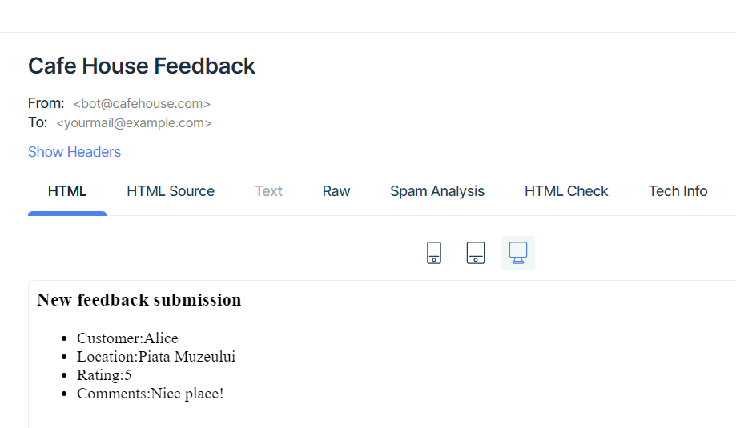

# Feedback-form

Python application for a feedback form, which automatically sends confirmation e-mail to the user after submitting their opinion. 
Created with Flask, PostgreSQL and deployed with Heroku. 

## Table of contents
* [General info](#general-info)
* [Technologies](#technologies)
* [Demo](#demo) 

## General info 
Café House is a fictitious cafe for which this feedback form was created. The user will be taken to the main page, where *Name* and *Location* fields are mandatory, 
and the rating mark is checked by default to five. An error message will be displayed after submit, in case of empty fields. 

After completing all the necessary fields, the user is prompted to a simple success page. Customers will not be able to submit the same
feedback twice if they use the same 
name. 

Email confirmation feature was implemented using [MailTrap]("mailtrap.io"). 

## Technologies 
Project is created with: 
* Python version: 3.8 
* Flask version: 2.1
* SQLAlchemy version: 1.4.37 

## Demo 
Deployed version: https://cafehousefeedback.herokuapp.com

